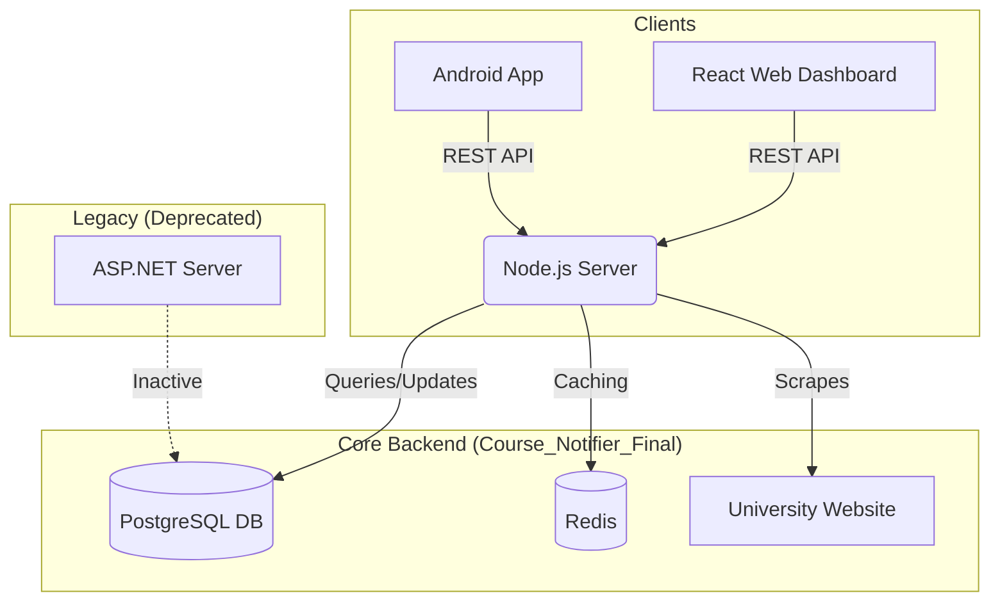

# Course Notifier - Master Architecture Guide

**Version:** 2.0 (January 2026)
**System Status:** Migration Complete (Legacy Deprecated)

This document outlines the high-level architecture of the Course Notifier ecosystem, explaining how the three major components (Legacy, Android, Modern Fullstack) interact.

---

## 1. The Big Picture

The system has evolved from a monolithic ASP.NET application into a modern, distributed architecture centered around a Node.js backend.

### 🛑 Legacy System (ASP.NET)
*   **Status:** **DEPRECATED / SAFE TO REMOVE**
*   **Role:** Former backend and scraper.
*   **Current State:** It is no longer needed. The Android app has been updated to bypass it, and the data scraping responsibility has been moved to the Node.js server.

### 📱 Android Application
*   **Status:** **ACTIVE**
*   **Role:** Native mobile client for students.
*   **Connection:** Connects **exclusively** to the Modern Node.js Backend (`api.coursenotifier...`).
*   **Function:** Allows students to search courses, filter by faculty, and receive push notifications for watched courses.

### ⚡ Modern Fullstack (Node.js + React)
*   **Status:** **ACTIVE (CORE)**
*   **Role:** The "Brain" of the operation.
*   **Components:**
    *   **Server (Node.js):** Handles API requests, Authentication (JWT), and runs the **Scraper**.
    *   **Client (React):** The web dashboard for students and the Admin Panel for system management.
    *   **Database (PostgreSQL):** Shared storage for all user and course data.

---

## 2. System Architecture Diagram

---

## 3. How Data Updates Work (The Scraper)

The most critical part of the system is the **Scraper**, which keeps course data in sync with the university.

1.  **Scheduler:** The `ScraperScheduler` inside the Node.js server triggers the job (configurable via Admin Panel).
2.  **Execution:** The server launches a Headless Chrome instance (Puppeteer).
3.  **Crawling:** It iterates through every Faculty and Study Period on the university website.
4.  **Parsing:** It reads the HTML table rows. Crucially, it checks the **background color** of rows to determine if a course is "Open" (Green/White) or "Closed" (Red).
5.  **Syncing:**
    *   It compares the scraped data with the Database.
    *   If a course status changes (Closed -> Open), it triggers the **Notification Service**.
    *   Users watching that course get an Email or Push Notification immediately.

---

## 4. Documentation Links

For detailed technical breakdowns of each component, refer to the specific guides created in this folder:

1.  **[Legacy ASP.NET Docs](Legacy_ASPNET_Documentation.md)**
    *   *Read this if:* You need to understand the old logic for archival purposes or if you decide to revive the secondary backup server.

2.  **[Android App Docs](Android_App_Documentation.md)**
    *   *Read this if:* You are developing features for the mobile app or debugging login/display issues on phones.

3.  **[Modern Fullstack Docs](Modern_Fullstack_Documentation.md)**
    *   *Read this if:* You are working on the main server, the React dashboard, the scraper logic, or database migrations.
